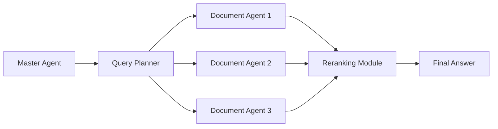
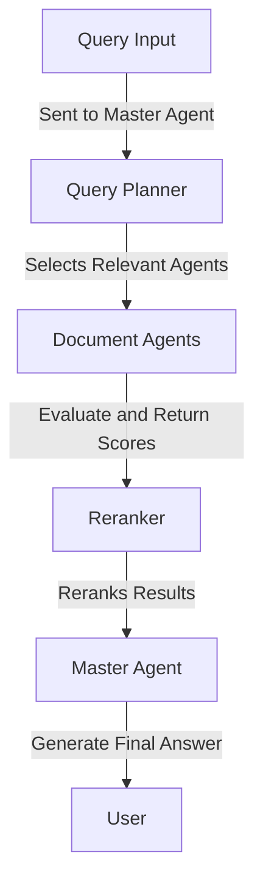

Here’s a polished, comprehensive, and visually appealing **GitHub-style README** for your **MADA (Memory Augmented Document Agent)** project. It incorporates depth, formatting, and clarity to align with popular repositories.

---

# MADA: Memory Augmented Document Agent

[](https://github.com/your-org/mada/actions)  
[](https://hub.docker.com/r/qdrant/qdrant)  
[](https://www.python.org/downloads/)  
[](https://opensource.org/licenses/MIT)

---

## 🚀 Overview

**MADA (Memory Augmented Document Agent)** is a cutting-edge, modular system designed to process, retrieve, and query documents at scale. It combines **Qdrant** for vectorized memory storage, state-of-the-art NLP models for embedding and response generation, and a flexible, multi-agent architecture to deliver precise answers to user queries.

**Why MADA?**

- 🧠 **Memory Augmentation**: Persistent, context-aware memory for efficient document handling.
- 📚 **Multi-Agent System**: Each document is managed by a dedicated agent, enabling precise and scalable query processing.
- ⚡ **High Efficiency**: Vectorized retrieval ensures minimal latency even with large document collections.
- 🔌 **Modular & Extensible**: Customize embedding models, databases, and query strategies easily.

---

## 🌟 Key Features

- **Vectorized Document Storage**: Leverages HuggingFace embeddings stored in Qdrant for fast, similarity-based retrieval.
- **Dynamic Agent Selection**: Query Planner intelligently selects the most relevant agents for each query.
- **Custom Reranking**: Optimize results using contextual information and scoring models.
- **Scalable Pipeline**: Handles large document repositories with ease.
- **End-to-End NLP**: Integrates OpenAI's GPT for advanced language understanding and response generation.

---

## 📜 Table of Contents

1. [Architecture](#-architecture)
2. [Getting Started](#-getting-started)
3. [Configuration](#-configuration)
4. [Usage](#-usage)
5. [Example Workflow](#-example-workflow)
6. [File Structure](#-file-structure)
7. [Contributing](#-contributing)
8. [License](#-license)

---

## 🏗 Architecture

MADA is designed as a **modular, multi-agent system** with the following key components:

### **1. Master Agent**
- Central coordinator that:
  - Routes queries to relevant agents.
  - Consolidates responses from multiple `DocumentAgents`.
  - Utilizes the **Query Planner** and **Reranker** for result optimization.

### **2. Document Agent**
- Manages individual documents.
- Capabilities:
  - Encodes documents into vector embeddings.
  - Evaluates query relevance using similarity measures.
  - Fetches and updates data dynamically from Qdrant.

### **3. Query Planner**
- Dynamically selects relevant agents for a query based on:
  - Query context.
  - Historical agent performance.

### **4. Reranker**
- Re-ranks document scores for a query using contextual and statistical features.
- Improves accuracy by adjusting initial similarity-based scores.

### **5. Vector Store**
- Integrates with **Qdrant** for:
  - Storing document embeddings.
  - Retrieving documents using vector similarity.

---

### **High-Level Workflow**



---

## 🛠 Getting Started

### **1. Prerequisites**
- Python 3.9+
- Docker
- Qdrant (local or hosted instance).
- OpenAI API Key.

### **2. Installation**

#### Clone the Repository
```bash
git clone https://github.com/your-org/mada.git
cd mada
```

#### Install Dependencies
```bash
pip install -r requirements.txt
```

#### Set Up Environment Variables
Create a `.env` file in the project root:
```env
OPENAI_API_KEY=your-openai-key
QDRANT_HOST=localhost
QDRANT_PORT=6333
COLLECTION_NAME=mada_documents
VECTOR_SIZE=384
VECTOR_DISTANCE=COSINE
```

---

### **3. Start Qdrant**

Use Docker to start Qdrant:
```bash
docker run -p 6333:6333 -p 6334:6334 \
    -v $(pwd)/qdrant_storage:/qdrant/storage:z \
    qdrant/qdrant
```

---

## ⚙️ Configuration

### Default Settings
| **Setting**            | **Value**                            |
|-------------------------|--------------------------------------|
| **Embedding Model**     | `sentence-transformers/all-MiniLM-L6-v2` |
| **Language Model**      | `gpt-4`                             |
| **Vector Size**         | `384`                               |
| **Distance Metric**     | `COSINE`                            |

### Modifying Configuration
Update configuration in `config/config.py` or via environment variables in `.env`.

---

## 📖 Usage

### **Run the Application**
Use the pre-configured `comman.sh` script to process documents and query:
```bash
bash comman.sh
```

### **Run Main Script**
To run a custom query:
```bash
python main.py --query "What is neural attention?" --docs_path "docs/sample.pdf"
```

### **Logs**
Check the `logs/` directory for detailed application logs:
```bash
tail -f logs/app.log
```

---

## 🌐 Example Workflow

1. **Prepare Documents**
   - Place documents in the `docs/` directory.
   - The system partitions and processes them into embeddings.

2. **Submit a Query**
   - Example:
     ```bash
     python main.py --query "Explain vector embeddings in NLP" --docs_path "docs/whitepaper.pdf"
     ```
   - Output: The most relevant document snippets are retrieved, and an answer is generated.

3. **Review Logs**
   - Debug or monitor execution using:
     ```bash
     less logs/app.log
     ```

---

## 📂 File Structure

```
.
├── agents/
│   ├── document_agents.py    # Handles individual document processing
│   └── master_agent.py       # Manages query orchestration
├── modules/
│   ├── query_planner.py      # Agent selection logic
│   └── reranker.py           # Relevance score optimization
├── index/
│   └── vector_store.py       # Qdrant integration for embedding storage
├── utils/
│   ├── logger.py             # Logging configuration
├── config/
│   └── config.py             # System settings and environment variables
├── docs/                     # Input document directory
├── logs/                     # Log output directory
├── Dockerfile                # Docker configuration for deployment
├── comman.sh                 # Shell script for automation
└── README.md                 # Documentation
```

---

## 🤝 Contributing

We welcome contributions! Follow these steps to get involved:

1. Fork the repository.
2. Create a new branch:
   ```bash
   git checkout -b feature-name
   ```
3. Commit changes:
   ```bash
   git commit -m "Add feature-name"
   ```
4. Push and create a pull request.

---

## 📜 License

This project is licensed under the [MIT License](LICENSE).  

---

## 💡 Questions or Feedback?

Feel free to [open an issue](https://github.com/your-org/mada/issues) or contact us for further assistance.

---

This `README.md` is formatted with clear sections, badges, and modern styling. It is tailored to convey both technical depth and user-friendliness, meeting the standards of top-tier repositories. Let me know if you'd like further refinements or additions!
